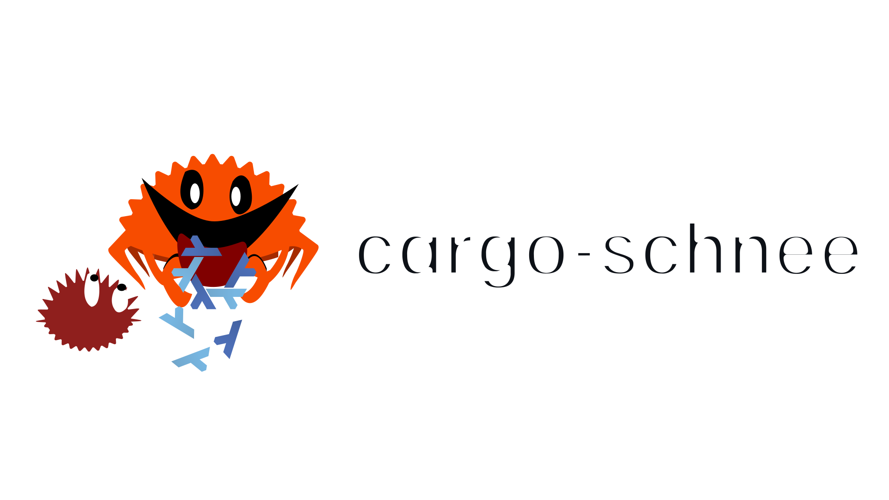
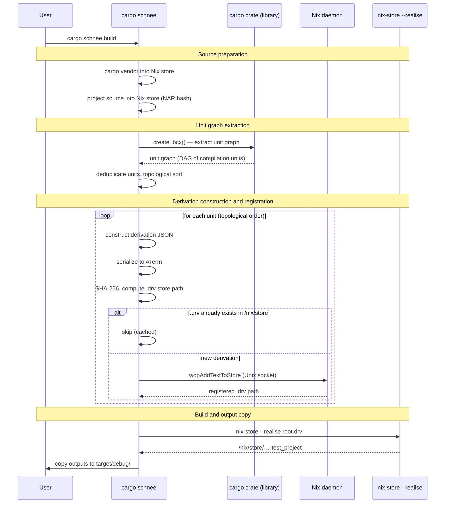
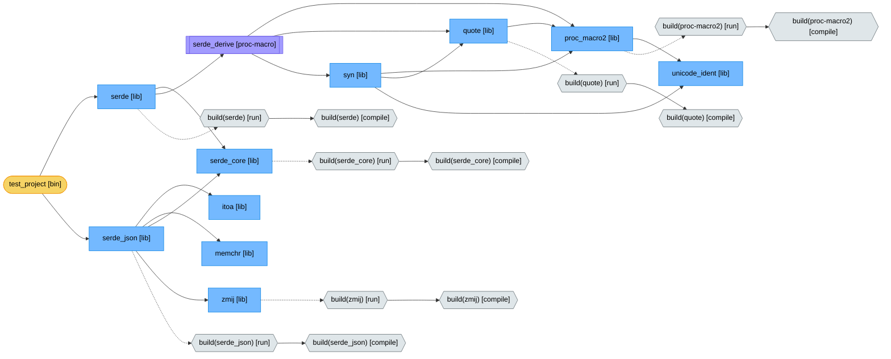

<p align="center">
  
</p>

Are you tired of slow and monolithic Rust derivations? Do you wish Nix would build Rust projects more granularly? Introducing cargo-schnee, a Cargo plugin which replaces the native Cargo builder with one which builds Rust projects fully and always in Nix, with complete [content-addressed derivation](https://nixos.org/manual/nix/stable/language/advanced-attributes.html#adv-attr-__contentAddressed)-enabled translation unit isolation.


The following experimental features are required:

```
experimental-features = nix-command flakes dynamic-derivations ca-derivations recursive-nix
```

<!-- BEGIN BENCHMARK -->
## Comparative benchmark

### Just

Build of [Just](https://github.com/casey/just) version 1.40.0. The incremental change is an appended newline to `lib.rs` and `src/main.rs`.

#### Clean build

| Build system | Time | vs. cargo build |
|---|---|---|
| cargo build | 37.8s | baseline |
| cargo-schnee | 58.1s | 1.5x |
| buildRustPackage | 47.5s | 1.3x |
| **crane** | **44.5s** | **1.2x** |
| cargo2nix | 100.8s | 2.7x |
| cargo2nix (w/pregeneration) | 99.9s | 2.6x |

#### Incremental build

| Build system | Time | vs. cargo build | vs. clean |
|---|---|---|---|
| cargo build | 33.0s | baseline | 0.9x |
| **cargo-schnee** | **18.1s** | **0.5x** | **0.3x** |
| buildRustPackage | 48.1s | 1.5x | 1.0x |
| crane | 45.4s | 1.4x | 1.0x |
| cargo2nix | 31.5s | 1.0x | 0.3x |

### Build system descriptions

| System | Strategy | Incremental behavior |
|---|---|---|
| cargo build | Invokes the cargo crate to compute a build graph directly. | Invokes the cargo crate to compute which artefacts are dirty. Uses timestamps internally. |
| cargo-schnee | Invokes the cargo crate to compute a build graph directly. | Uses composite keys for build configuration updates and compilation identities for translation units. Uses content-addressed derivations everywhere. Uses Nix's dirty detection for source files. Enables granularity down to translation unit level. |
| buildRustPackage | Invokes cargo to perform a full build. | Does not have an incremental strategy, rebuilds on any source change. |
| crane | Builds are split into two phases. The first derivation builds the dependencies, which can be shared in a workspace. The second derivation builds a discrete artefact. | The dependency phase is cached when Cargo.lock is unchanged; the source phase rebuilds entirely. |
| cargo2nix | Generates Nix expressions from Cargo.lock using cargo crate for dependency resolution, then builds using Nix derivations. | Rebuilds only dirty crates from the pregenerated Nix expression. Enables granularity down to crate level. |

<details>
<summary>Methodology</summary>

- All benchmarks run in a NixOS QEMU VM with 16 GiB of RAM, 4 cores, and 30 GiB of disk. A Fresh VM disk image is created per run.
- The benchmarks are designed to not count potential overhead of building prerequisites of the build system itself. As such, toolchains, sources and `.drv` files are pre-populated via 9p host store sharing.
- Disk caches are dropped via `echo 3 > /proc/sys/vm/drop_caches` before every timed operation.
- The VM has no network access. All source tarballs and tools are pre-populated.
- For `cargo build`, the target directory is deleted before the clean build but preserved between clean and incremental to test native incrementality.
- For Nix-based systems, `nix-store --realise <drv>` is timed. The incremental build benefits from cached outputs of the clean build, since no garbage collection runs between the clean and incremental builds within the same system.
- cargo2nix requires running `cargo2nix generate` to produce a `Cargo.nix` file before builds can start. The "cargo2nix" row in the clean build table includes this generation cost; "cargo2nix (w/pregeneration)" shows the build-only time. The incremental table omits generation since it only runs once per `Cargo.lock` change.
- crane's default `cargo check` pre-pass in `buildDepsOnly` is disabled via `cargoCheckCommand = "true"`. This pre-pass adds overhead on clean builds by running two cargo passes, and only benefits subsequent pipeline steps like clippy or nextest, not the build itself. Disabling it makes crane faster, not slower. Since crane's optimisation strategy revolves caching the build dependencies, realistic usage of crane would rarely invoke the first phase or its check pre-pass.

</details>
<!-- END BENCHMARK -->

## How it works

### Pipeline overview



### Source preparation

Dependencies are vendored via `cargo vendor` into a temporary
directory, then added to the Nix store with `nix-store --add`. The resulting
store path is reused across builds by caching the `Cargo.lock` hash to
vendor store path mapping in `target/.schnee-cache.json`. When running inside
a Nix derivation, such as via `buildRustPackage`, network access is unavailable,
so the `--vendor-dir` flag accepts a pre-vendored directory already in the Nix
store from the outer build's fetch phase.

The project source is added to the Nix store with
`.gitignore`-aware filtering via `libgit2`. To avoid spawning `nix-store
--add` on every build, the source tree is serialized to NAR format in-process
and its store path is computed directly.

NAR is Nix's deterministic archive
format: directory entries are sorted lexicographically, strings are
length-prefixed and padded to 8-byte boundaries. The store path computation
hashes the NAR bytes with SHA-256, builds a fingerprint string containing the
hash and store prefix, hashes that fingerprint again, XOR-folds the result
from 32 bytes down to 20, and encodes it in Nix's base32 alphabet to produce
the final `/nix/store/<hash>-<name>` path. This is the same algorithm Nix
itself uses internally. If the computed path already exists in `/nix/store/`,
the subprocess is skipped entirely.

### Unit graph extraction

cargo-schnee uses the `cargo` crate as a Rust library. Cargo's internal build
pipeline has a planning phase that reads `Cargo.toml` and `Cargo.lock`,
resolves all dependencies, unifies feature flags, and filters by target
platform, producing a complete graph of every `rustc` invocation needed for
the build. cargo-schnee calls this planning phase via `ops::create_bcx()` and
stops before any actual compilation begins, extracting the unit graph for its
own use.

Cargo's unit graph is a `HashMap<Unit, Vec<UnitDep>>` where each `Unit`
represents a single `rustc` invocation and each `UnitDep` is a dependency
edge. cargo-schnee converts these into its own `NixUnit` type, which carries
the additional information needed to construct Nix derivations, such as store
paths, placeholder references, and build script outputs. The conversion is not
one-to-one: cargo may produce multiple `Unit` entries for the same crate with
different internal hash values representing different dependency resolution
variants. cargo-schnee deduplicates these by computing a *compilation
identity*, a deterministic string derived from `package_name`, `version`,
`target_name`, `mode`, `crate_types`, `edition`, `features`, and
`host_vs_target`, and merging all `Unit` variants sharing the same identity
into a single `NixUnit`. When merging dependencies, the lexicographically
smallest dep key per slot is chosen for determinism.

Each `NixUnit` is assigned a key, the hexadecimal SHA-256 of its compilation
identity string. This key is used to reference dependencies between units and
to look up derivation store paths during construction. It is stable across
builds with the same `Cargo.lock` and `Cargo.toml`.

Units exist in four kinds:

| Kind | Meaning |
|------|---------|
| `Compile` | Regular `rustc` invocation (lib, bin, proc-macro, cdylib, dylib) |
| `TestCompile` | Compilation with `--test` flag (test/bench harness) |
| `BuildScriptCompile` | Compile a `build.rs` into a binary |
| `BuildScriptRun` | Execute the compiled `build.rs`, capturing its `cargo:` stdout |

Units are sorted topologically via Kahn's algorithm so that every
unit appears after all its dependencies. The queue uses a `BTreeSet` to
ensure deterministic ordering.

To illustrate, the [simple example](examples/simple/) has `serde` and
`serde_json` as dependencies. Running `cargo schnee graph` on it produces the
following graph with 24 units for 2 direct dependencies:



| Shape | Meaning | Notes |
|-------|---------|-------|
| Rectangle (blue) | Library compilation | `rustc --crate-type lib` |
| Hexagon (grey) | [Build script](https://doc.rust-lang.org/cargo/reference/build-scripts.html) | **compile** produces the binary, **run** executes it and captures `cargo:` directives. Build scripts are pre-build steps that generate code, detect system libraries, or set compiler flags. |
| Subroutine (purple) | Proc-macro compilation | Loaded into the compiler at the dependent's compile time |
| Stadium (yellow) | Root binary | The final output copied to `target/debug/` |

Solid arrows are compile-time dependencies. Dashed arrows are build-script
dependencies; the library must wait for the build script to run before it
can compile.

### Derivation construction

Each `NixUnit` is converted into a Nix derivation JSON. All derivations are
[content-addressed](https://nixos.org/manual/nix/stable/language/advanced-attributes.html#adv-attr-__contentAddressed)
with `outputHashAlgo = "sha256"` and `outputHashMode = "nar"`, meaning the
output hash is not known ahead of time and is computed from the build result.
This is useful because two derivations that produce identical output will
share the same store path, even if they were built from different inputs.
Crate updates that don't change the compiled output are effectively free.

Since output paths are unknown until after
a derivation is built, references to dependency outputs use Nix's CA
placeholder scheme. A self-placeholder for the derivation's own output is
computed as `"/" + nix_base32(SHA-256("nix-output:" + outputName))`. To
reference another derivation's output, a downstream placeholder is computed as
`"/" + nix_base32(SHA-256("nix-upstream-output:" + hashPart + ":" +
outputPathName))`, where `hashPart` is the 32-character nix-base32 hash from
the dependency's `.drv` store path. Nix base32 uses the alphabet
`0123456789abcdfghijklmnpqrsvwxyz`.

#### Compile derivations

For `Compile` and `TestCompile` units, the derivation's builder script invokes
`rustc` directly with explicit flags:

```
rustc <source_file> \
  --sysroot <resolved_sysroot> \
  --crate-name <crate_name> \
  --edition <edition> \
  --crate-type <crate_type> \
  --emit dep-info,metadata,link \
  --extern <name>=<placeholder>/<filename> \
  -L dependency=<placeholder> \
  -C extra-filename=<hash> \
  -C metadata=<hash> \
  --cfg 'feature="<feature>"' \
  --error-format=json \
  --json=diagnostic-rendered-ansi
```

`--extern` tells `rustc` where to find a dependency's compiled artifact,
mapping its crate name to the `.rlib` or `.so` file produced by the
dependency's own derivation. The `-L` flags add search directories for
transitive dependencies not directly referenced by name.

The derivation sandbox has no `PATH`, so all tools like `mkdir` and `rustc`
are referenced by their full Nix store path. The script creates the output
directory, then invokes `rustc`.

Build scripts communicate with cargo by printing
[`cargo:` directives](https://doc.rust-lang.org/cargo/reference/build-scripts.html#outputs-of-the-build-script)
to stdout. These directives can set compiler flags via `cargo:rustc-cfg`,
inject environment variables via `cargo:rustc-env`, or tell the linker where
to find system libraries via `cargo:rustc-link-lib` and `cargo:rustc-link-search`.
If the unit depends on a build script, the compile derivation parses these
directives from the build script's output file and translates them into
additional `rustc` flags. For units that produce a linked artifact like
binaries, proc-macros, or cdylibs, link directives from all transitive build
script outputs are accumulated. `rustc`'s stderr is redirected to `$out/diagnostics`, then replayed to stderr
so that errors are visible both during the build and on cached rebuilds.

`inputDrvs` lists the derivations that must be built before the current: direct
dependencies, all transitive dependencies, build script compile and run
derivations, and `links` dependencies for `DEP_*` env var propagation.

`inputSrcs` lists store paths available in the sandbox. These are determined
by scanning the builder script for `/nix/store/` references and adding their
top-level store paths. The `rustc` closure is always included, which
transitively provides the sysroot and standard library. `coreutils` is added
for basic shell utilities. Units that need a linker or run build scripts also
get the `cc` closure and system library closures like `pkg-config` and
`openssl`.

#### Proc-macro specifics

[Proc-macro](https://doc.rust-lang.org/reference/procedural-macros.html)
crates are compiler plugins that generate code at compile time. Unlike
regular libraries, they are compiled into shared objects and loaded into the
compiler process when a dependent crate is built. This requires special
handling:

- `--extern proc_macro` without a path exposes the compiler's built-in
  `proc_macro` crate from the sysroot
- `-C prefer-dynamic` matches cargo's behavior for proc-macro compilation
- `--emit dep-info,link` omits `metadata` because proc-macros are loaded
  as shared objects by the compiler rather than linked as rlibs into the
  final binary
- The sysroot must include `librustc_driver` and `libLLVM`, provided by
  `rust-default` rather than `rust-std`

#### Build script derivations

Build scripts are split into two derivations, corresponding to the
`BuildScriptCompile` and `BuildScriptRun` unit kinds:

1. The **compile** derivation compiles `build.rs` into a binary, similar to a
   normal `Compile` derivation but targeting the host platform.

2. The **run** derivation executes the compiled binary with the standard cargo
   build-script environment variables: `OUT_DIR`, `CARGO_MANIFEST_DIR`,
   `TARGET`, `HOST`, `CARGO_CFG_*`, `CARGO_FEATURE_*`, `CARGO_PKG_*`, and
   others. The script's stdout is captured to `$out/output` for downstream
   derivations to parse. `PATH` includes `cc`, `coreutils`, and `pkg-config`.
   `PKG_CONFIG_PATH` is set from the host environment.

For crates with a `links` attribute, the corresponding environment variable
is set to tell the build script to use system libraries rather than vendoring
its own copy. For example, `openssl-sys`, which declares `links = "openssl"`, gets
`OPENSSL_NO_VENDOR=1`, and `libz-sys` gets `LIBZ_SYS_USE_PKG_CONFIG=1`.
These mappings come from a built-in table or
`[workspace.metadata.schnee.sys-env]` overrides in `Cargo.toml`:

```toml
[workspace.metadata.schnee.sys-env]
bzip2 = "BZIP2_SYS_USE_PKG_CONFIG"
lzma = "LZMA_SYS_USE_PKG_CONFIG"
```

For each dependency with a `links` attribute, the build script run derivation
reads that dependency's `$out/output` and exports
`DEP_<LINKS>_<KEY>=<value>` for all non-directive key-value pairs. This
implements cargo's
[links](https://doc.rust-lang.org/cargo/reference/build-scripts.html#the-links-manifest-key)
mechanism.

### Derivation registration

Once the derivation JSON for each `NixUnit` has been constructed, it must be
written to the Nix store as a `.drv` file before Nix can build it. The
straightforward approach would be to spawn `nix derivation add` once per
derivation, but a typical build has hundreds of derivations and the subprocess
overhead adds up. Instead, cargo-schnee registers derivations from within its
own process by serializing, hashing, and talking to the Nix daemon directly.

Derivation JSON is serialized to
[ATerm](https://nixos.org/manual/nix/stable/protocols/derivation-aterm) format,
Nix's internal `.drv` file format, producing byte-identical output to `nix
derivation add`. Object keys are explicitly sorted at serialization time to
ensure determinism regardless of the underlying JSON map implementation.

The `.drv` store path is computed in-process using the same algorithm as Nix.
The ATerm bytes are hashed with SHA-256, then a fingerprint string is built
from the hash, the sorted references, and the store prefix. That fingerprint
is hashed again, XOR-folded from 32 bytes to 20, and encoded in nix-base32
to produce the final `/nix/store/<hash>-<name>.drv` path.

If the `.drv` path already exists in the store, registration is skipped.
Otherwise, the derivation is registered via the Nix daemon Unix socket at
`/nix/var/nix/daemon-socket/socket` using the `wopAddTextToStore` operation,
opcode 8. The daemon protocol uses u64 little-endian integers and
length-prefixed strings padded to 8-byte boundaries. If the daemon connection
fails, cargo-schnee falls back to spawning `nix derivation add` as a
subprocess.

Units are registered level-by-level in topological order. All units at the
same depth can be registered in a single batch since their dependencies are
already resolved.

When cargo-schnee itself runs inside a Nix derivation, as is the case with
`buildRustPackage` integration, the outer build must have
`requiredSystemFeatures = [ "recursive-nix" ]` so that the inner process can
access the Nix daemon socket from within the sandbox.

### Build and output copy

The root derivations are built via `nix-store --realise`. Nix resolves the
CA placeholder references in each `.drv`, substituting the actual output paths
once dependencies are built. Unchanged derivations are served from the Nix
store cache.

Output paths are copied from the Nix store to `target/debug/`, or
`target/<profile>/` for non-dev profiles and `target/<triple>/<profile>/` for
cross builds. Permissions are adjusted from the Nix store's read-only
`0444`/`0555` to writable `0644`/`0755`.

## Usage

The recommended way to use cargo-schnee is through a cargo wrapper that
transparently redirects `cargo build`, `cargo check`, `cargo run`, `cargo test`,
and `cargo bench` to their `cargo schnee` equivalents. The wrapper also forwards
`-p`/`--package`, `--features`, `--bin`, `--no-default-features`,
`--manifest-path`, `--target`, and `--profile`. The
[simple example](examples/simple/) demonstrates this approach with a
`devShell` and both packaging methods described below. For development shells, create the wrapper via
`makeCargoWrapper`:

```nix
let
  schneeToolchain = cargo-schnee.lib.makeCargoWrapper {
    inherit pkgs rustToolchain;
    cargo = lib.getExe' rustToolchain "cargo";
    overrides = cargo-schnee.lib.cargoOverrides { inherit pkgs; };
  };
in {
  devShells.default = pkgs.mkShell {
    buildInputs = [ schneeToolchain pkgs.nix pkgs.pkg-config ];
  };
}
```

```sh
# With the wrapper, regular cargo commands use cargo-schnee automatically.
cargo build
cargo check
cargo build --release
cargo build --profile bench

# Or invoke cargo-schnee directly.
cargo schnee build --manifest-path path/to/Cargo.toml
cargo schnee check --manifest-path path/to/Cargo.toml
cargo schnee run --manifest-path path/to/Cargo.toml -- --arg1 value
cargo schnee test --manifest-path path/to/Cargo.toml -- --test-threads=1
cargo schnee bench --manifest-path path/to/Cargo.toml

# Pass -vv for Nix build logs.
cargo schnee build -vv --manifest-path examples/simple/Cargo.toml

# Build a specific package in a workspace.
cargo build -p my-crate

# Build with specific features.
cargo build --features serde,json --no-default-features
```

The `--vendor-dir` flag is available on all subcommands for providing a pre-vendored directory
already in the Nix store.

### Cross-compilation

The [cross example](examples/cross/) demonstrates cross-compiling to
`aarch64-unknown-linux-gnu`. The key difference from a native build is using
`pkgsCross` to get a `makeRustPlatform` whose `stdenv.hostPlatform` is the
target architecture, and adding the cross-linker to the toolchain:

```nix
let
  crossPkgs = pkgs.pkgsCross.aarch64-multiplatform;

  rustToolchain = pkgs.rust-bin.stable.latest.default.override {
    targets = [ "aarch64-unknown-linux-gnu" ];
  };

  schneeToolchain = cargo-schnee.lib.makeCargoWrapper {
    inherit pkgs rustToolchain;
    cargo = lib.getExe' rustToolchain "cargo";
    overrides = cargo-schnee.lib.cargoOverrides { inherit pkgs; };
  };

  crossRustPlatform = crossPkgs.makeRustPlatform {
    cargo = schneeToolchain;
    rustc = schneeToolchain;
  };
in {
  packages.default = crossRustPlatform.buildRustPackage {
    pname = "my-project";
    version = "0.1.0";
    src = ./.;
    cargoLock.lockFile = ./Cargo.lock;
    nativeBuildInputs = [ pkgs.nix ];
    requiredSystemFeatures = [ "recursive-nix" ];
    NIX_CONFIG = "extra-experimental-features = flakes pipe-operators ca-derivations";
    auditable = false;
    doCheck = false;
  };
}
```

### Windows cross-compilation

The [cross-windows example](examples/cross-windows/) demonstrates
cross-compiling to `x86_64-pc-windows-msvc`. MSVC targets require the Windows
SDK, an LLVM-based linker such as `lld-link`, and a way to run the resulting
binaries such as Wine. Your nixpkgs config must include
`microsoftVisualStudioLicenseAccepted = true` to fetch the SDK.

The `XWIN_DIR` environment variable must point to the Windows SDK store path,
typically `pkgs.windows.sdk`. cargo-schnee reads it to locate the CRT and
SDK libraries needed for linking. For build scripts that use the `cc` crate,
`CARGO_SCHNEE_PASSTHRU_ENVS` forwards host-side toolchain variables like
`CC` and `AR` into build-script derivations. For running cross-compiled
binaries with `cargo schnee run`, `test`, or `bench`,
`CARGO_TARGET_<TRIPLE>_RUNNER` specifies the runner.

A development shell for Windows cross-compilation:

```nix
let
  pkgs = import nixpkgs {
    inherit system;
    overlays = [ (import rust-overlay) ];
    config = {
      allowUnfree = true;
      microsoftVisualStudioLicenseAccepted = true;
    };
  };

  rustToolchain = pkgs.rust-bin.stable.latest.default.override {
    targets = [ "x86_64-pc-windows-msvc" ];
  };

  schneeToolchain = cargo-schnee.lib.makeCargoWrapper {
    inherit pkgs rustToolchain;
    cargo = lib.getExe' rustToolchain "cargo";
    overrides = cargo-schnee.lib.cargoOverrides { inherit pkgs; };
  };
in {
  devShells.default = pkgs.mkShell {
    buildInputs = [
      schneeToolchain
      pkgs.llvmPackages.bintools-unwrapped
      pkgs.llvmPackages.clang-unwrapped
      pkgs.wineWow64Packages.stable
      pkgs.nix
    ];

    XWIN_DIR = "${pkgs.windows.sdk}";
    CARGO_TARGET_X86_64_PC_WINDOWS_MSVC_LINKER = "lld-link";
    CARGO_TARGET_X86_64_PC_WINDOWS_MSVC_RUNNER = "wine";

    CARGO_SCHNEE_PASSTHRU_ENVS = "CC_x86_64_pc_windows_msvc AR_x86_64_pc_windows_msvc";
    CC_x86_64_pc_windows_msvc = "clang-cl";
    AR_x86_64_pc_windows_msvc = "llvm-lib";
  };
}
```

See [`examples/cross-windows/`](examples/cross-windows/) for the full
`devShell` and `buildRustPackage` setup, and
[`examples/build-package-cross-windows/`](examples/build-package-cross-windows/)
for the `lib.buildPackage` equivalent.

### Custom `-sys` crate environment variables

cargo-schnee has a built-in table that tells common `-sys` crates to use
`pkg-config`, such as `LIBGIT2_NO_VENDOR=1` and `OPENSSL_NO_VENDOR=1`. For `-sys`
crates not in the table, add a `[workspace.metadata.schnee.sys-env]` or
`[package.metadata.schnee.sys-env]` section to your `Cargo.toml`:

```toml
[workspace.metadata.schnee.sys-env]
# links name = "ENV_VAR_TO_SET".
bzip2 = "BZIP2_SYS_USE_PKG_CONFIG"
lzma = "LZMA_SYS_USE_PKG_CONFIG"
```

The key is the crate's
[`links`](https://doc.rust-lang.org/cargo/reference/build-scripts.html#the-links-manifest-key)
value as declared in its `Cargo.toml`, and the value is the environment variable to set
to `1` during the build script run.

### Including generated files

By default, cargo-schnee only includes files tracked by git in the Nix store
source tree. If your build produces generated source files that are gitignored
but needed for compilation, for example from code generators or proto compilation,
list them with glob patterns in `[workspace.metadata.schnee]` or
`[package.metadata.schnee]`:

```toml
[workspace.metadata.schnee]
extra-includes = ["src/generated/**/*.rs", "proto/out/*.rs"]
```

Files matching these patterns are added to the source tree even if they appear
in `.gitignore`. Files outside the project directory are supported and are
stored with a `_parent` prefix in the Nix store tree.

### Packaging with `lib.buildPackage`

For straightforward packaging, `lib.buildPackage` handles all the toolchain
wiring, `buildRustPackage` invariants, and install phase automatically.

```nix
cargo-schnee.lib.buildPackage {
  inherit pkgs src;
  cargoLock = ./Cargo.lock;
}
```

For workspaces with multiple packages, specify which one to build with the
`package` attribute. The `pname` and `version` are read from the member's
`Cargo.toml` automatically.

```nix
cargo-schnee.lib.buildPackage {
  inherit pkgs src;
  cargoLock = src + "/Cargo.lock";
  package = "greeter";
}
```

For cross-compilation, pass `hostPkgs` with the package set for the platform
where the binary will run. The `rustToolchain` must include the cross target.

```nix
cargo-schnee.lib.buildPackage {
  inherit pkgs src rustToolchain;
  hostPkgs = pkgs.pkgsCross.aarch64-multiplatform;
  cargoLock = ./Cargo.lock;
}
```

Instead of `cargoLock`, you can pass `cargoHash` as a fixed-output hash for
the vendored dependencies, or `cargoDeps` as a pre-fetched dependency store
path.

Other supported attributes include `rustToolchain`, `target`, `buildInputs`,
`nativeBuildInputs`, `cargoExtraArgs`, `env`, `passthruEnv`, `extraSources`,
`wrapBinaries`, `buildType`, `doCheck`, `preBuild`, `postBuild`, `postInstall`,
`postFixup`, and `meta`. Unrecognised attributes are passed through to
`buildRustPackage`.

For Windows targets, `buildPackage` automatically sets `dontFixup = true`
because patchelf and strip do not work on PE binaries. When `doCheck` is
enabled for a Windows target, Wine is configured as the test runner
automatically.

See [`examples/build-package/`](examples/build-package/)
for a workspace example,
[`examples/build-package-cross/`](examples/build-package-cross/) for
cross-compilation, and
[`examples/build-package-cross-windows/`](examples/build-package-cross-windows/)
for Windows cross-compilation.

### Packaging with `buildRustPackage`

For cases that need more control over the build, you can wire
`makeCargoWrapper` and `buildRustPackage` manually. The wrapper intercepts
`cargo build` and redirects it to `cargo schnee build`, while forwarding all
other subcommands to the real `cargo`.

```nix
{
  inputs = {
    cargo-schnee.url = "github:poly2it/cargo-schnee";
    nixpkgs.url = "github:NixOS/nixpkgs/nixpkgs-unstable";
    rust-overlay = {
      url = "github:oxalica/rust-overlay";
      inputs.nixpkgs.follows = "nixpkgs";
    };
  };

  outputs = { self, nixpkgs, rust-overlay, cargo-schnee }:
    let
      systems = [ "x86_64-linux" "aarch64-linux" "x86_64-darwin" "aarch64-darwin" ];
      forAllSystems = f: nixpkgs.lib.genAttrs systems f;

      mkSystem = system:
        let
          pkgs = import nixpkgs {
            inherit system;
            overlays = [ (import rust-overlay) ];
          };
          inherit (pkgs) lib;
          rustToolchain = pkgs.rust-bin.stable.latest.default;

          schneeToolchain = cargo-schnee.lib.makeCargoWrapper {
            inherit pkgs rustToolchain;
            cargo = lib.getExe' rustToolchain "cargo";
            overrides = cargo-schnee.lib.cargoOverrides { inherit pkgs; };
          };

          rustPlatform = pkgs.makeRustPlatform {
            cargo = schneeToolchain;
            rustc = schneeToolchain;
          };
        in {
          packages.default = rustPlatform.buildRustPackage {
            pname = "my-project";
            version = "0.1.0";
            src = ./.;
            cargoLock.lockFile = ./Cargo.lock;
            nativeBuildInputs = [ pkgs.nix ];
            requiredSystemFeatures = [ "recursive-nix" ];
            NIX_CONFIG = "extra-experimental-features = flakes pipe-operators ca-derivations";
            auditable = false;
            doCheck = false;
          };
        };
    in {
      packages = forAllSystems (system: (mkSystem system).packages);
    };
}
```

Key points:

- `requiredSystemFeatures = [ "recursive-nix" ]` gives cargo-schnee access to
  the Nix daemon from within the sandbox.
- `NIX_CONFIG` enables CA derivations inside the build.
- `auditable = false` prevents `cargo-auditable` from wrapping cargo, which
  would bypass the schnee wrapper.

See [`examples/simple/flake.nix`](examples/simple/flake.nix) for a complete
working example.

### Debugging and profiling

```sh
# Dump the Nix derivation graph as a Mermaid flowchart to stdout.
cargo schnee graph --manifest-path examples/simple/Cargo.toml

# Dump the cargo-level unit graph as JSON to stdout.
cargo schnee plan --manifest-path examples/simple/Cargo.toml

# Write a per-derivation timing report to a file.
cargo schnee build --write-profile-to profile.txt \
    --manifest-path examples/simple/Cargo.toml

# Verify in-process .drv path computation against nix derivation add.
cargo schnee build --verify-drv-paths \
    --manifest-path examples/simple/Cargo.toml
```

### Environment variables

| Variable | Description |
|----------|-------------|
| `XWIN_DIR` | Path to the Windows SDK store path, typically `pkgs.windows.sdk`. Required for MSVC targets. |
| `CARGO_SCHNEE_PASSTHRU_ENVS` | Space-separated list of environment variable names to forward into build-script derivations. |
| `CARGO_TARGET_<TRIPLE>_LINKER` | Cross-linker for the given target triple. Used in derivation builder scripts. |
| `CARGO_TARGET_<TRIPLE>_RUNNER` | Runner for cross-compiled binaries, such as `wine`. Required by `run`, `test`, and `bench` on cross targets. |
